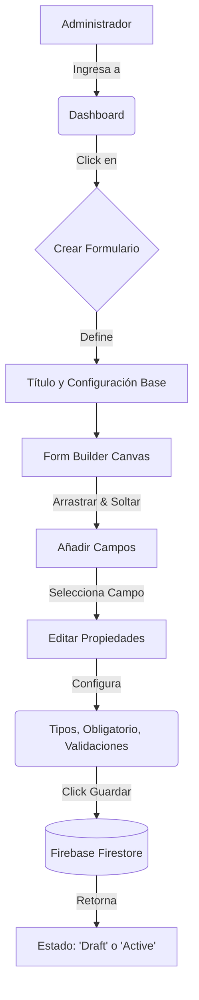
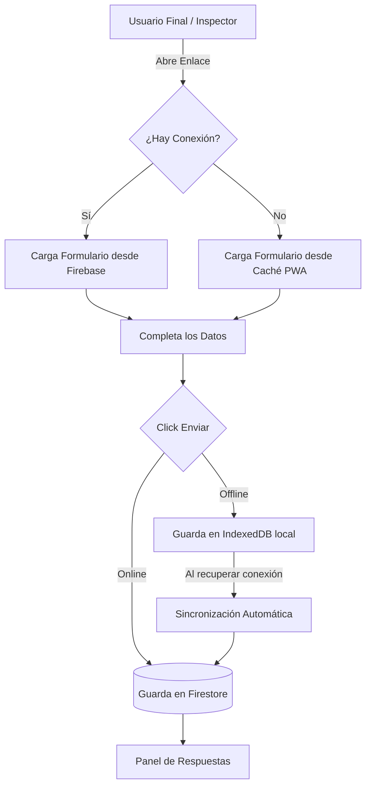

# Forma Flow - Modernización Municipal

Sistema SaaS integral para la gestión de formularios dinámicos, flujos de trabajo e inspecciones. Creado para optimizar los procesos internos de la Municipalidad, permitiendo la recolección de datos en tiempo real, auditoría de respuestas y organización de la información de forma centralizada.

---

## 📊 Diagramas de Flujo del Sistema

A continuación se detallan los flujos de trabajo principales de **Forma Flow**, desde la creación de un formulario hasta el análisis de las respuestas.

### 1. Flujo de Creación y Edición de Formularios (FormBuilder)


### 2. Flujo de Recolección de Datos (Vista Pública y Offline)


---

## 📸 Pantallas Principales

*(Reemplaza estos enlaces por las rutas relativas o URLs de tus imágenes cuando tomes las capturas. Puedes guardarlas en una carpeta `docs/` o `public/assets/` dentro del proyecto).*

### Dashboard Principal
Métricas en tiempo real, actividad reciente y acceso rápido.


### FormBuilder Avanzado (Layout de 3 Columnas)
Creador de formularios tipo "Drag and Drop" con inspector contextual.


### Mesa de Entradas (Vista de Respuestas)
Análisis Tri-pane con lista de formularios, listado de registros y visor individual con exportación a PDF.


---

## 🌟 Características Principales

Basado en la arquitectura premium "True Black", el sistema ofrece:
- **FormBuilder Avanzado (Layout Tri-Pane)**: Creador de formularios drag-and-drop con inspector de propiedades contextual.
- **Explorador de Respuestas (Mesa de Entradas)**: Interfaz de 3 columnas para navegar entre formularios, filtrar envíos y auditar respuestas al instante.
- **Generación de Actas de Auditoría**: Descarga directa de reportes PDF tabulados usando jsPDF.
- **Dashboards en Tiempo Real**: Tarjetas de métricas (Stat Cards) con estilo *Glow Ambient* para el monitoreo de KPIs de la plataforma.
- **Sincronización Offline First**: Funcionamiento robusto incluso con conectividad intermitente ideal para trabajo de campo en la Municipalidad.

## 🛠️ Stack Tecnológico

El proyecto está construido con un stack moderno, enfocado en performance y estética premium:

### Frontend
- **React 19**: Biblioteca principal para la construcción de interfaces.
- **Vite**: Bundler y entorno de desarrollo ultra rápido.
- **Tailwind CSS v4**: Estilos utilitarios para un diseño *Glassmorphism* personalizado.
- **Lucide React**: Íconos vectoriales modernos de alta resolución.
- **Zustand / Context API**: Manejo de estado global para la sesión y UI.

### Infraestructura (Firebase)
Usamos **Firebase** como nuestro único backend (BaaS - Backend as a Service), aprovechando:
- **Firestore**: Base de datos NoSQL en tiempo real para almacenar formularios, respuestas, configuraciones de áreas y usuarios.
- **Authentication**: Autenticación segura de usuarios y roles administrativos.
- **Storage**: Almacenamiento nube para adjuntos y firmas.
- **Hosting**: Alojamiento web ultrarrápido con CDN global.

---

## 💻 Desarrollo Local (Cómo probarlo en tu compu)

Para levantar el proyecto en tu entorno local, seguí estos pasos:

1. **Cloná el repositorio**:
   ```bash
   git clone <url-del-repo>
   cd forma-flow
   ```

2. **Instalá las dependencias**:
   Solo tenés que abrir tu terminal en la carpeta del proyecto y correr este único comando para bajar todo lo necesario:
   ```bash
   npm install
   ```

3. **Configurá las variables de entorno**:
   Creá un archivo `.env` en la raíz del proyecto y pegá las credenciales de Firebase de tu proyecto de desarrollo.

4. **Levantá el servidor de desarrollo**:
   ```bash
   npm run dev
   ```
   Al finalizar, abrí tu navegador y entrá a `http://localhost:5173` para ver la app funcionando.

---

## 🚀 Despliegue en Producción (Firebase Hosting)

Cuando quieras publicar una nueva versión online:

1. **Autenticate en Firebase CLI** (si no lo hiciste antes):
   ```bash
   firebase login
   ```

2. **Apunta al proyecto correcto**:
   ```bash
   firebase use <id-de-tu-proyecto-firebase>
   ```

3. **Construí la aplicación (Build)**:
   ```bash
   npm run build
   ```

4. **Desplegá a Hosting**:
   ```bash
   firebase deploy --only hosting
   ```

---

**Desarrollado para el equipo de Modernización de la Municipalidad de San Carlos.** 
*Interfaces de nivel mundial para la gestión pública ágil.*
