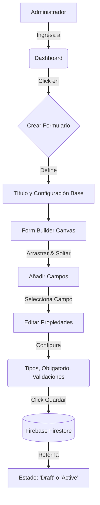
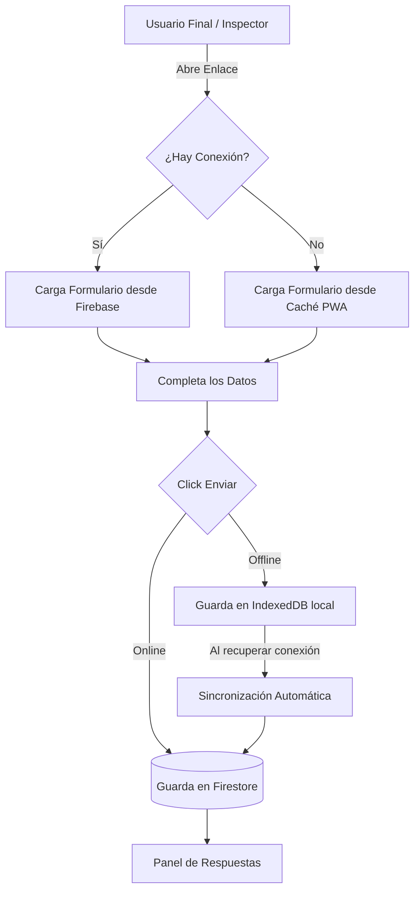

# Forma Flow - Modernización Municipal

Sistema SaaS integral para la gestión de formularios dinámicos, flujos de trabajo e inspecciones. Creado para optimizar los procesos internos de la Municipalidad, permitiendo la recolección de datos en tiempo real, auditoría de respuestas y organización de la información de forma centralizada.

---

## 📚 Wiki Oficial del Proyecto

Hemos centralizado todos los detalles operativos (Estructura de Funciones, Interfaz de Botones, Lógica de Firebase y Layouts UI/UX) en la **Wiki de GitHub** para mantener este documento introductorio ágil.

👉 **[Explorar la Wiki Detallada de Forma Flow en GitHub](https://github.com/modernizacionsancarlos/forma-flow/wiki)**

---

## 📊 Diagramas de Flujo del Sistema

A continuación se detallan los flujos de trabajo principales de **Forma Flow**, desde la creación de un formulario hasta el análisis de las respuestas.

### 1. Flujo de Creación y Edición de Formularios (FormBuilder)


### 2. Flujo de Recolección de Datos (Vista Pública y Offline)


---

## 📸 Pantallas Principales

*(Reemplaza estos enlaces por las rutas relativas o URLs de tus imágenes cuando tomes las capturas. Puedes guardarlas en una carpeta `docs/` o `public/assets/` dentro del proyecto).*

### Dashboard Principal
Métricas en tiempo real, actividad reciente y acceso rápido.


### FormBuilder Avanzado (Layout de 3 Columnas)
Creador de formularios tipo "Drag and Drop" con inspector contextual.


### Mesa de Entradas (Vista de Respuestas)
Análisis Tri-pane con lista de formularios, listado de registros y visor individual con exportación a PDF.


---

## 🌟 Características Principales

Basado en la arquitectura premium "True Black", el sistema ofrece:
- **FormBuilder Avanzado (Layout Tri-Pane)**: Creador de formularios drag-and-drop con inspector de propiedades contextual.
- **Explorador de Respuestas (Mesa de Entradas)**: Interfaz de 3 columnas para navegar entre formularios, filtrar envíos y auditar respuestas al instante.
- **Generación de Actas de Auditoría**: Descarga directa de reportes PDF tabulados usando jsPDF.
- **Dashboards en Tiempo Real**: Tarjetas de métricas (Stat Cards) con estilo *Glow Ambient* para el monitoreo de KPIs de la plataforma.
- **Sincronización Offline First**: Funcionamiento robusto incluso con conectividad intermitente ideal para trabajo de campo en la Municipalidad.

## 🛠️ Stack Tecnológico

El proyecto está construido con un stack moderno, enfocado en performance y estética premium:

### Frontend
- **React 19**: Biblioteca principal para la construcción de interfaces.
- **Vite**: Bundler y entorno de desarrollo ultra rápido.
- **Tailwind CSS v4**: Estilos utilitarios para un diseño *Glassmorphism* personalizado.
- **Lucide React**: Íconos vectoriales modernos de alta resolución.
- **Zustand / Context API**: Manejo de estado global para la sesión y UI.

## 🔥 Arquitectura e Infraestructura Firebase

Forma Flow es una aplicación **Serverless** que depende íntegramente del ecosistema de Firebase (BaaS) para proveer un rendimiento de alta disponibilidad, persistencia en tiempo real y una barrera de seguridad robusta sin necesidad de gestionar servidores propios.

```mermaid
graph TD
    classDef client fill:#18181b,stroke:#3b82f6,stroke-width:2px,color:#fff;
    classDef fbCore fill:#1e293b,stroke:#f59e0b,stroke-width:2px,color:#fff;
    classDef fbSec fill:#312e81,stroke:#8b5cf6,stroke-width:2px,color:#fff;

    Usuario((👤 Usuario /<br>Administrador)):::client

    subgraph Firebase Cloud [Ecosistema Firebase - Backend as a Service]
        Hosting[🌐 Hosting<br>CDN Global de Frontend]:::fbCore
        Auth[🔐 Authentication<br>Motor de Identidad]:::fbCore
        Rules[🛡️ Security Rules<br>Motor de Políticas y Accesos]:::fbSec
        Firestore[🗄️ Firestore Database<br>BD NoSQL en Tiempo Real]:::fbCore
        Storage[📂 Cloud Storage<br>Archivos y Adjuntos]:::fbCore
    end

    Usuario -->|1. Accede a la URL| Hosting
    Usuario -->|2. Inicia Sesión Segura| Auth
    Auth -->|Retorna Token (JWT)| Usuario

    Usuario -->|3. Consulta / Guarda Datos| Rules
    Usuario -->|4. Sube Fotos o Firmas| Rules

    Rules -->|Valida Rol de Usuario| Firestore
    Rules -->|Autoriza tamaño/tipo| Storage
    
    Firestore -.->|Sincronización Realtime| Usuario
```

### Detalle Estructural de los Servicios Utilizados

- **🌐 Firebase Hosting**: Sirve nuestra aplicación compilada en React (dist) globalmente usando la CDN avanzada de Google. Proporciona tiempos de carga ultrarrápidos, caché perimetral agresivo y certificados SSL pre-configurados. Es el hogar de nuestro Frontend.
- **🔐 Firebase Authentication**: Controla el embudo de acceso al sistema (Portal de Gestión, Mesa de Entradas, Creador). Nos proporciona los JWT (JSON Web Tokens) que el framework React mantiene en el provider de AuthContext protegido, aislando la lógica administrativa de los usuarios comunes visualmente en el cliente.
- **🛡️ Firestore Security Rules**: Es la barrera defensiva innegociable de la infraestructura. Valida lógicamente cada petición que llega a la Base de Datos para asegurar que usuarios sin privilegios no puedan leer, borrar o alterar información municipal sensible de bases cruzadas.
- **🗄️ Firestore Database**: Corazón de la plataforma. Base de datos no relacional que almacena los nodos paramétricos completos de cada formulario dinámico, la lista tabular de inspectores, las respuestas de los ciudadanos y los cruces de áreas. Gracias a sus WebSockets internos, las vistas de la "Mesa de Entradas" reflejan los nuevos registros *en tiempo real* según ingresan.
- **📂 Firebase Cloud Storage**: Servicio de almacenamiento de objetos binarios masivos de Google Cloud, destinado asíncronamente a guardar cargas pesadas asociadas a formularios específicos, como firmas dactilares dibujadas en Canvas, fotografías de constancias o documentos en PDF generados.
---

## 💻 Desarrollo Local (Cómo probarlo en tu compu)

Para levantar el proyecto en tu entorno local, seguí estos pasos:

1. **Cloná el repositorio**:
   ```bash
   git clone <url-del-repo>
   cd forma-flow
   ```

2. **Instalá las dependencias**:
   Solo tenés que abrir tu terminal en la carpeta del proyecto y correr este único comando para bajar todo lo necesario:
   ```bash
   npm install
   ```

3. **Configurá las variables de entorno**:
   Creá un archivo `.env` en la raíz del proyecto y pegá las credenciales de Firebase de tu proyecto de desarrollo.

4. **Levantá el servidor de desarrollo**:
   ```bash
   npm run dev
   ```
   Al finalizar, abrí tu navegador y entrá a `http://localhost:5173` para ver la app funcionando.

---

## 🚀 Despliegue en Producción (Firebase Hosting)

Cuando quieras publicar una nueva versión online:

1. **Autenticate en Firebase CLI** (si no lo hiciste antes):
   ```bash
   firebase login
   ```

2. **Apunta al proyecto correcto**:
   ```bash
   firebase use <id-de-tu-proyecto-firebase>
   ```

3. **Construí la aplicación (Build)**:
   ```bash
   npm run build
   ```

4. **Desplegá a Hosting**:
   ```bash
   firebase deploy --only hosting
   ```

---

**Desarrollado para el equipo de Modernización de la Municipalidad de San Carlos.** 
*Interfaces de nivel mundial para la gestión pública ágil.*
