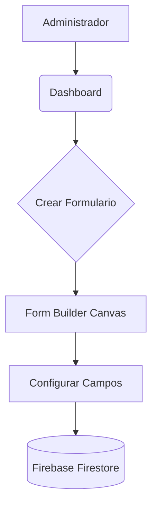
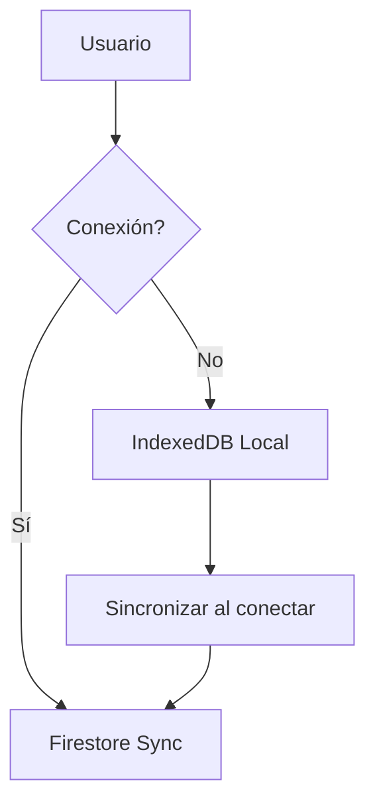
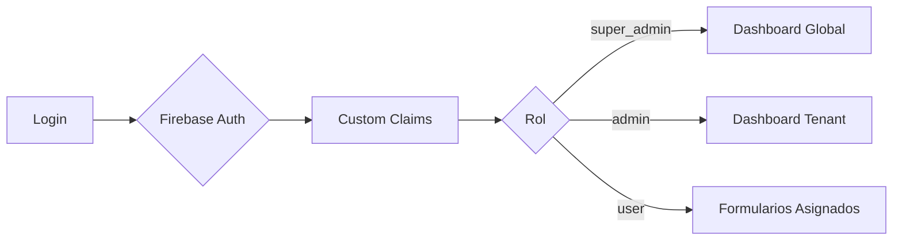

<div align="center">

# ⚡ Forma Flow

**Plataforma SaaS Multi-Tenant para Gestión de Formularios Dinámicos**

[](https://formaflow-sancarlos.web.app)
[](https://react.dev)
[](https://vitejs.dev)
[](https://web.dev/progressive-web-apps/)
[]()

</div>

---

## 🌟 ¿Qué es Forma Flow?

Forma Flow es una plataforma diseñada para digitalizar la gestión pública. Permite a los administradores municipales crear formularios inteligentes en minutos, a los inspectores realizar auditorías en campo (incluso sin internet) y a la mesa de entradas visualizar datos procesados con exportación automática a documentos oficiales.

> **🔗 App en Producción:** [formaflow-sancarlos.web.app](https://formaflow-sancarlos.web.app)

---

## 📸 Capturas de Pantalla

### Panel de Control (Dashboard)
El dashboard principal muestra KPIs en tiempo real, métricas del sistema, actividad reciente y accesos rápidos de administración. Incluye saludo dinámico por franja horaria y reloj en vivo.


### Inicio de Sesión
Acceso seguro con Firebase Authentication, soporte multi-tenant y diseño premium True Black.


### Mesa de Entradas (Submissions)
Sistema tri-pane para revisión masiva de respuestas, con filtros por estado, auditoría detallada y línea de tiempo de cada trámite.


---

## ✨ Características Principales

| Módulo | Descripción |
|---|---|
| **FormBuilder Drag & Drop** | Creación visual de formularios con secciones, campos dinámicos e inspector de propiedades |
| **Motor Offline-First (PWA)** | Funciona sin conectividad, almacena respuestas localmente y sincroniza al recuperar señal |
| **Mesa de Entradas Pro** | Interfaz tri-pane para auditoría masiva con estados, filtros y exportación |
| **Workflows** | Motor de flujos de trabajo con transiciones de estado configurables |
| **Exportación Real** | Generación de archivos XLSX y JSON desde datos reales en Firestore + upload a Storage |
| **Multi-Tenant** | Arquitectura White Label con aislamiento por organización |
| **Dashboard BI** | Estadísticas en tiempo real, métricas de resolución y actividad del sistema |
| **Auditoría** | Registro completo de acciones con trazabilidad por usuario y timestamp |
| **Notificaciones Push** | Alertas en tiempo real vía Firebase Cloud Messaging |
| **Portal Ciudadano** | Formularios de acceso público para trámites ciudadanos |

---

## 🏗️ Arquitectura Técnica

```
┌─────────────────────────────────────────────────────────────┐
│                    FRONTEND (React + Vite)                    │
│  ┌──────────┐ ┌──────────┐ ┌──────────┐ ┌───────────────┐  │
│  │Dashboard │ │FormBuilder│ │  Mesa de │ │    Portal     │  │
│  │   BI     │ │ Drag&Drop│ │ Entradas │ │  Ciudadano    │  │
│  └────┬─────┘ └────┬─────┘ └────┬─────┘ └──────┬────────┘  │
│       └─────────────┴────────────┴──────────────┘            │
│                         │ React Query Hooks                  │
│  ┌──────────────────────┴──────────────────────────────────┐ │
│  │ useAreas │ useWorkflows │ useExports │ useSubmissions   │ │
│  │ useForms │ useTenants   │ useUsers   │ useGlobalStats   │ │
│  └──────────────────────┬──────────────────────────────────┘ │
└──────────────────────────┼───────────────────────────────────┘
                           │
┌──────────────────────────┼───────────────────────────────────┐
│                     FIREBASE BACKEND                          │
│  ┌──────────┐ ┌──────────┐ ┌──────────┐ ┌───────────────┐  │
│  │Firestore │ │   Auth   │ │ Storage  │ │   Hosting     │  │
│  │ Database │ │ + Roles  │ │  (Files) │ │   (PWA)       │  │
│  └──────────┘ └──────────┘ └──────────┘ └───────────────┘  │
└──────────────────────────────────────────────────────────────┘
```

---

## 🛠️ Requisitos del Sistema

### Software Requerido
- **Node.js** v18.0.0+ — [Descargar](https://nodejs.org/)
- **npm** v9.0.0+ (incluido con Node.js)
- **Git** — [Descargar](https://git-scm.com/)
- **Firebase CLI** — incluido localmente en el proyecto, no requiere instalación global

### Herramientas de Desarrollo Recomendadas
- **IDE:** [Cursor](https://cursor.sh/), [Trae AI](https://www.trae.ai/) o VS Code con extensiones Agentic AI
- **Asistente:** [Antigravity](https://github.com/google-deepmind/antigravity) (pair programming avanzado)

### Infraestructura
- Proyecto en [Firebase Console](https://console.firebase.google.com/) con los servicios: **Hosting**, **Firestore**, **Authentication** y **Storage**

---

## 💻 Instalación

### 1. Clonar el Repositorio
```bash
git clone https://github.com/modernizacionsancarlos/forma-flow.git
cd forma-flow
```

### 2. Instalar Dependencias
```bash
npm install
```

### 3. Configurar Variables de Entorno
Copia el archivo de ejemplo y completa los valores:
```bash
cp .env.example .env
```

Las credenciales se encuentran en la [Consola de Firebase](https://console.firebase.google.com/) → Configuración del proyecto → General.

La clave VAPID para notificaciones push se obtiene en Firebase Console → Cloud Messaging → Web Push certificates.

Opcional: para usar un logo privado (sin subir al repo), agrega estas variables en tu `.env` local:

```bash
VITE_MUNICIPAL_LOGO_PATH=/local-assets/municipal-logo.png
VITE_MUNICIPAL_LOGO_FILTER=brightness(0) invert(1) opacity(0.92)
```

> `VITE_MUNICIPAL_LOGO_PATH` debe apuntar a un archivo dentro de `public/`.
>  
> Ejemplo recomendado (privado): `public/local-assets/municipal-logo.png`
>  
> Ese archivo está excluido del repositorio en `.gitignore`.

### 4. Levantar el Entorno de Desarrollo
```bash
npm run dev
```
La aplicación estará disponible en `http://localhost:5173`

---

## 🚀 Deploy a Producción

### Primera vez — vincular el proyecto:
```bash
npx firebase use --add
```

### Build + Deploy (un solo comando):
```bash
npm run build-deploy
```

### Comandos disponibles:
| Comando | Acción |
|---|---|
| `npm run dev` | Servidor de desarrollo local con HMR |
| `npm run build` | Compilación optimizada para producción |
| `npm run deploy` | Sube archivos compilados a Firebase Hosting |
| `npm run build-deploy` | Build + Deploy secuencial |

> [!TIP]
> **Windows:** Si prefieres usar `firebase` directamente sin instalación global, hemos incluido puentes (`firebase.cmd` y `firebase.ps1`) en la raíz del proyecto. En PowerShell: `.\\firebase deploy`

---

## 🔥 Flujo Firebase CLI (Cursor)

Para ejecutar Firebase desde terminal en Cursor (Windows/PowerShell), sigue la guía paso a paso:

👉 `docs/firebase-cli-flujo-recomendado.md`

Comando base recomendado:

```bash
npx.cmd -y firebase-tools@latest <comando>
```

---

## 📊 Diagramas de Flujo

### Proceso de Creación (Administrador)


### Proceso de Recolección (Inspector/Ciudadano)


### Flujo de Autenticación Multi-Tenant


---

## 📁 Estructura del Proyecto

```
forma-flow/
├── public/               # Assets estáticos y manifest PWA
├── src/
│   ├── api/              # Hooks de datos (React Query + Firestore)
│   ├── components/       # Componentes reutilizables
│   ├── lib/              # Firebase config, AuthContext, utilidades
│   ├── pages/            # Vistas principales de la aplicación
│   └── main.jsx          # Entry point
├── docs/
│   └── screenshots/      # Capturas para documentación
├── firebase.json         # Configuración de servicios Firebase
├── firestore.rules       # Reglas de seguridad Firestore
├── storage.rules         # Reglas de seguridad Storage
├── .env.example          # Plantilla de variables de entorno
└── vite.config.js        # Configuración de Vite + PWA
```

---

## 📚 Wiki y Documentación Detallada

¿Necesitas entender cómo funciona el código, los componentes o la base de datos por dentro?

👉 **[ACCEDER A LA WIKI OFICIAL EN GITHUB](https://github.com/modernizacionsancarlos/forma-flow/wiki)**

---

## 🔐 Seguridad

- **Autenticación:** Firebase Auth con Custom Claims por rol (super_admin, admin, user)
- **Firestore Rules:** Aislamiento por tenant con validación de claims
- **Storage Rules:** Acceso restringido por organización
- **Variables de entorno:** Credenciales excluidas del repositorio vía `.gitignore`

---

## 🛡️ Roles del Sistema

| Rol | Permisos |
|---|---|
| `super_admin` | Acceso total: gestión de empresas, usuarios, configuración global |
| `admin` | Administración dentro de su organización (tenant) |
| `user` | Acceso a formularios asignados y envío de respuestas |

---

<div align="center">

**Desarrollado para el equipo de Modernización de la Municipalidad de San Carlos.**

*Interfaces de nivel mundial para la gestión pública ágil.*

</div>
