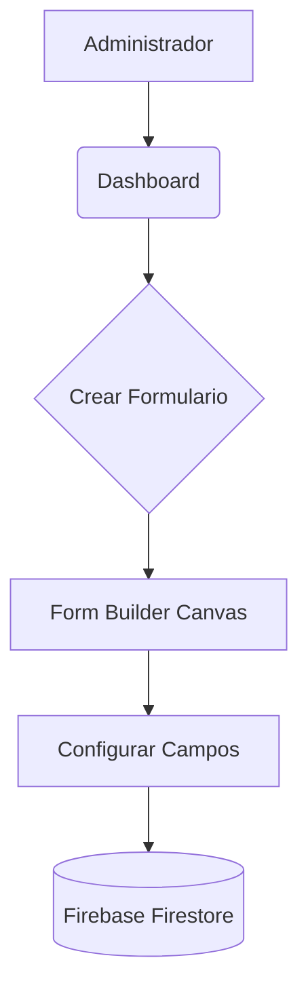
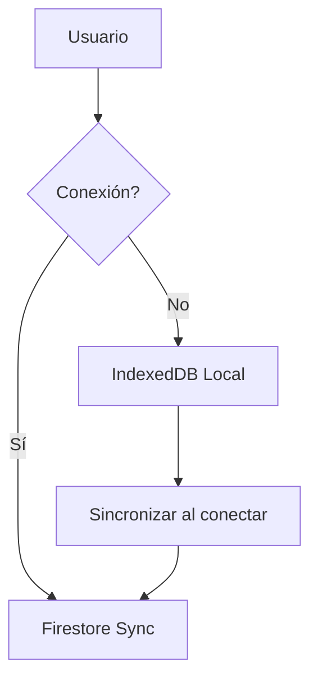

# Forma Flow - Modernización Municipal

Sistema SaaS integral para la gestión de formularios dinámicos, flujos de trabajo e inspecciones. Creado para optimizar los procesos internos de la Municipalidad, permitiendo la recolección de datos en tiempo real, auditoría de respuestas y organización de la información de forma centralizada.

---

## 🌟 ¿Qué es Forma Flow?

Forma Flow es una plataforma diseñada para digitalizar la gestión pública. Permite a los administradores municipales crear formularios inteligentes en minutos, a los inspectores realizar auditorías en campo (incluso sin internet) y a la mesa de entradas visualizar datos procesados con exportación automática a documentos oficiales.

### Características Clave:
- **FormBuilder Avanzado**: Interfaz Drag-and-Drop con inspector de propiedades.
- **Modo Offline-First**: Funciona sin conectividad y sincroniza al recuperar señal.
- **Mesa de Entradas Pro**: Sistema Tri-pane para auditoría masiva de registros.
- **Exportación a PDF**: Generación inmediata de actas y reportes con sello municipal.
- **Arquitectura True Black**: Diseño premium optimizado para reducir fatiga visual y consumo de energía.

---

## 🛠️ Requisitos del Sistema

Antes de comenzar, asegúrate de tener instalado lo siguiente en tu equipo:

### 1. Requisitos de Software
- **Node.js (v18.0.0 o superior)**: Entorno de ejecución para el frontend. [Descargar aquí](https://nodejs.org/)
- **npm (v9.0.0 o superior)**: Gestor de paquetes (viene con Node.js).
- **Git**: Para el control de versiones y clonación del proyecto. [Descargar aquí](https://git-scm.com/)
- **Firebase CLI**: Herramienta para gestionar el despliegue y servicios de Google.
  ```bash
  npm install -g firebase-tools
  ```

### 2. Herramientas de Desarrollo (Vibe Coding)
Para mantener la agilidad y el estándar de calidad del proyecto, se recomienda el uso de entornos con IA integrada:
- **IDE**: [Cursor](https://cursor.sh/), [Trae AI](https://www.trae.ai/) o VS Code con extensiones de Agentic AI.
- **Asistente**: [Antigravity](https://github.com/google-deepmind/antigravity) (Recomendado para pair programming avanzado y automatización de tareas complejas).

### 3. Infraestructura (Cuenta de Google)
- Un proyecto creado en la [Consola de Firebase](https://console.firebase.google.com/).
- Servicios activos: **Hosting**, **Firestore Database**, **Authentication** y **Storage**.

---

## 💻 Instalación y Configuración

Sigue estos pasos detallados para poner en marcha el sistema:

### Paso 1: Clonar el Repositorio
Abre tu terminal y ejecuta:
```bash
git clone https://github.com/modernizacionsancarlos/forma-flow.git
cd forma-flow
```

### Paso 2: Instalar Dependencias
Instala todas las librerías necesarias del frontend:
```bash
npm install
```

### Paso 3: Variables de Entorno
Crea un archivo llamado `.env` en la raíz del proyecto y pega tus credenciales de Firebase. Puedes encontrarlas en la configuración de tu proyecto en la consola de Firebase:
```env
VITE_FIREBASE_API_KEY=tu_api_key
VITE_FIREBASE_AUTH_DOMAIN=tu_proyecto.firebaseapp.com
VITE_FIREBASE_PROJECT_ID=tu_proyecto
VITE_FIREBASE_STORAGE_BUCKET=tu_proyecto.appspot.com
VITE_FIREBASE_MESSAGING_SENDER_ID=tu_id
VITE_FIREBASE_APP_ID=tu_app_id
```

### Paso 4: Levantar el Entorno de Desarrollo
Inicia el servidor local de Vite:
```bash
npm run dev
```
La aplicación estará disponible en `http://localhost:5173`.

---

## 🚀 Despliegue a Producción

Para publicar el sistema en los servidores de Firebase Hosting:

1. **Iniciar sesión en Firebase**: `firebase login`
2. **Vincular el proyecto**: `firebase use --add` (y elige tu ID de proyecto).
3. **Generar la estructura de producción**: 
   ```bash
   npm run build
   ```
4. **Desplegar**:
   ```bash
   firebase deploy --only hosting
   ```

---

## 📊 Diagramas de Flujo

### Proceso de Creación (Administrador)


### Proceso de Recolección (Inspector/Ciudadano)


---

## 📚 Wiki y Documentación Detallada

¿Necesitas entender cómo funciona el código, los botones o la base de datos por dentro? Hemos preparado una documentación exhaustiva para desarrolladores y administradores.

👉 **[ACCEDER A LA WIKI OFICIAL EN GITHUB](https://github.com/modernizacionsancarlos/forma-flow/wiki)**

---

**Desarrollado para el equipo de Modernización de la Municipalidad de San Carlos.** 
*Interfaces de nivel mundial para la gestión pública ágil.*
