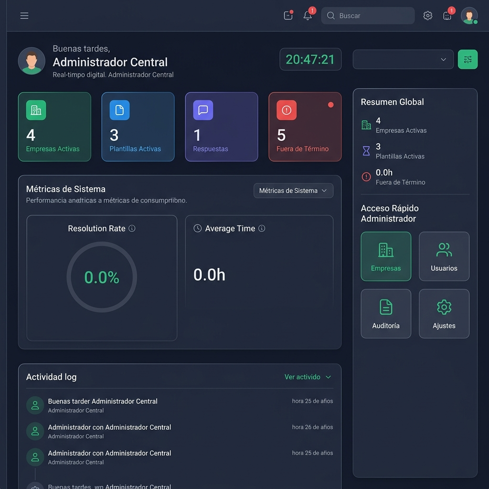
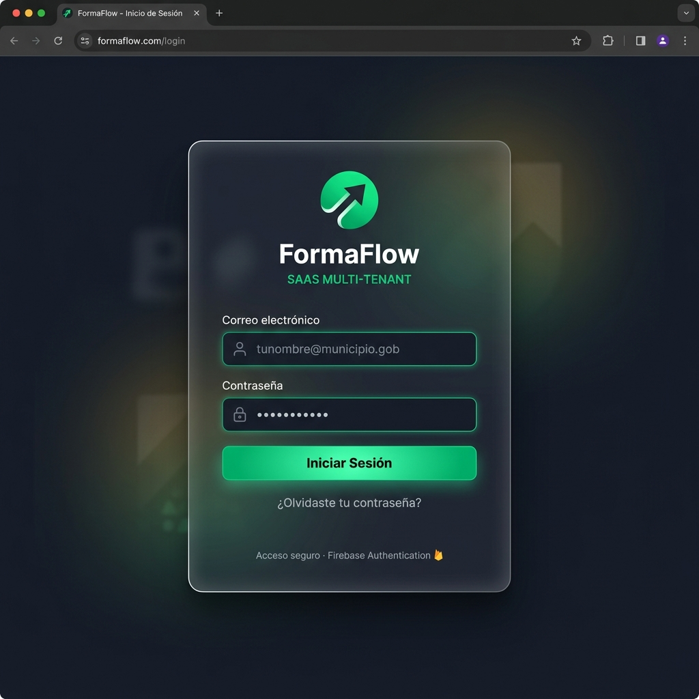
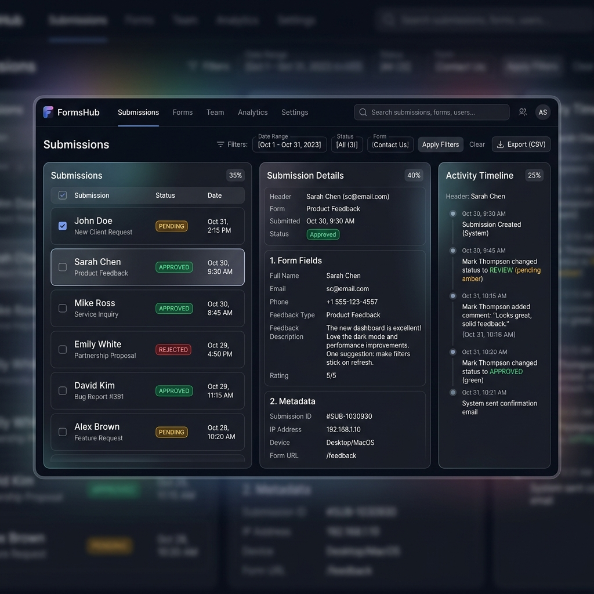

<

---

## 📸 Vista General del Sistema

### Dashboard Principal
Panel de control con KPIs en tiempo real, métricas de resolución, actividad reciente del sistema y reloj en vivo. El saludo se adapta automáticamente a la franja horaria: Buenos días, Buenas tardes, Buenas noches o Buen turno nocturno.

### Inicio de Sesión
Autenticación segura con Firebase Auth, soporte para múltiples organizaciones y roles (super_admin, admin, user).

### Mesa de Entradas
Interfaz tri-pane para revisión masiva de respuestas. Filtros por estado, auditoría detallada con timestamp e historial de cada trámite.

---

## 📑 Índice por Niveles

### 🟢 Nivel: Fácil — Usuario General
Ideal para personal administrativo o nuevos integrantes del equipo.
- [**🚀 Guía de Operación Diaria**](Operacion-Usuario.md): ¿Cómo creo un formulario? ¿Dónde veo las respuestas? Guía paso a paso sin tecnicismos.
- [**🎨 Interfaz de Usuario (UI/UX)**](Componentes-UI.md): Explicación del diseño True Black, navegación y componentes visuales.

### 🟡 Nivel: Intermedio — Técnico
Para quienes necesiten entender la lógica detrás de cada pantalla.
- [**🛠️ Módulo FormBuilder**](Flujo-FormBuilder.md): Cómo se construyen las preguntas, secciones y qué opciones tiene cada campo.
- [**📥 Módulo Mesa de Entradas**](Mesa-de-Entradas.md): Cómo se filtran las respuestas, el proceso de revisión y la generación de exportaciones.

### 🔴 Nivel: Avanzado — Desarrollo
Para desarrolladores senior que darán mantenimiento al núcleo del sistema.
- [**🔥 Arquitectura Firebase Backend**](Firebase-y-Backend.md): Estructura NoSQL, Security Rules, Authentication y Storage.
- [**🧩 Lógica de Estado y Offline**](Estado-y-Offline.md): Motor PWA, cola de sincronización y manejo de conectividad.

---

## 🔐 Modelo de Seguridad

### Roles del Sistema
| Rol | Alcance | Permisos |
|---|---|---|
| `super_admin` | Global | Gestión de empresas, usuarios, configuración, auditoría completa |
| `admin` | Por Tenant | Administración de formularios, respuestas y usuarios dentro de su organización |
| `user` | Por Tenant | Acceso a formularios asignados y envío de respuestas |

### Capas de Protección
1. **Firebase Auth** — Autenticación con JWT y Custom Claims
2. **Firestore Rules** — Aislamiento por `tenantId` en cada documento
3. **Storage Rules** — Acceso a archivos restringido por organización
4. **Frontend Guards** — `<ProtectedRoute>` y `<Guard>` en el router

---

## 🗄️ Colecciones de Firestore

| Colección | Propósito |
|---|---|
| `forms_schemas` | Plantillas de formularios creadas en el FormBuilder |
| `submissions` | Respuestas enviadas por usuarios (datos + metadatos + estado) |
| `userProfiles` | Perfiles de usuario con rol, tenant y configuración |
| `tenants` | Organizaciones registradas (empresas/municipios) |
| `areas` | Departamentos y ubicaciones dentro de cada tenant |
| `workflows` | Flujos de trabajo con transiciones de estado |
| `exports` | Registro de exportaciones realizadas (XLSX/JSON) |
| `audit_log` | Registro de auditoría con trazabilidad completa |

---

## ⚙️ API Hooks (Capa de Datos)

Todos los hooks están en `src/api/` y usan **React Query** sobre **Firestore**:

| Hook | Archivo | Funciones |
|---|---|---|
| `useAreas()` | `useAreas.js` | CRUD de áreas con auditoría |
| `useWorkflows()` | `useWorkflows.js` | CRUD de workflows con toggle de estado |
| `useForms()` | `useForms.js` | CRUD de plantillas de formulario |
| `useSubmissions()` | `useSubmissions.js` | Motor offline-first con cola y sync |
| `useExports()` | `useExports.js` | Registro + upload a Storage |
| `useTenants()` | `useTenants.js` | Gestión de organizaciones |
| `useUsers()` | `useUsers.js` | Gestión de usuarios y roles |
| `useGlobalStats()` | `useGlobalStats.js` | Métricas BI del dashboard |

---

## 📱 PWA y Offline

Forma Flow es una Progressive Web App instalable con soporte offline completo:

- **Service Worker** con Workbox (precache de 36 archivos, ~3 MB)
- **Cola de sincronización** en `localStorage` para respuestas sin conexión
- **Sync automático** al detectar reconexión a internet
- **Instalable** como app nativa en Android, iOS y escritorio

---

👉 **[Volver al README del Proyecto](../../README.md)**
]]>
